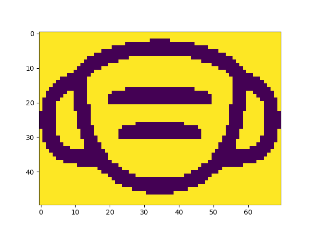

# Why re-develope COCO API ?

[COCO](https://github.com/cocodataset/cocoapi)'s original libraries for encoding and decoding [RLE](https://en.wikipedia.org/wiki/Run-length_encoding) masks were developed in standard C and are commonly used to represent objects detected by neural networks. However, normally there are no problems on Linux to use the original standard Python/API but on Windows you may encounter complaints about pip installing or having to import DLL libraries.

To avoid all this in a project where I only needed to decode the masks in a Windows environment, I translated from C to have an equivalent Python version of the decode function. Sorry, if you also need encoding function in Python maybe you could contact me to help and (together) add a compatible encode :smile: function soon.

Anyway, thanks to use my version and may the force be with you.

## Encoding
Usual encoding with standard COCO library (used in this example):
```
compatible_mask = np.asfortranarray(mask,dtype=np.uint8)
rlemask = encode(compatible_mask)
rlemask['counts'] = str(rlemask['counts'],'utf-8')
```

## Decoding
As [testwin](testwin.py) script shows:
```
from forkcocowin import coco_decode
import matplotlib.pyplot as plt

rlemask = {'size': [50,70], 'counts': '0g05b08J4M2N2NA^O1`0OCO=0E090H080IO68DH;>@C>a0_O_O`0j0OWOF<:CM72I24NL43JM92FN;1ENKO72L0LO91J0MO92INO0NO122OO0M031O000NO31OO11MO40N011MO41MO21L06OL021L06OL021L06OL021L060J040L060J040L060J040L060J040L060J040L060J040L060KO31L060KO31L06OL021L06OL021L06OL021MO41MO21MO40N100NO310O00M0310O00NO1220NO92IONO91KOMO72M0<1EO:2GN63KM34OLM73JF<;=1G_O_Ob0=AC`07EH=1IO71H090F0:1DO>1_O1b0>2N2N3L6H]O'}
mask = coco_decode(rlemask)
plt.imshow(mask)
plt.show()
```
And _voilà_
